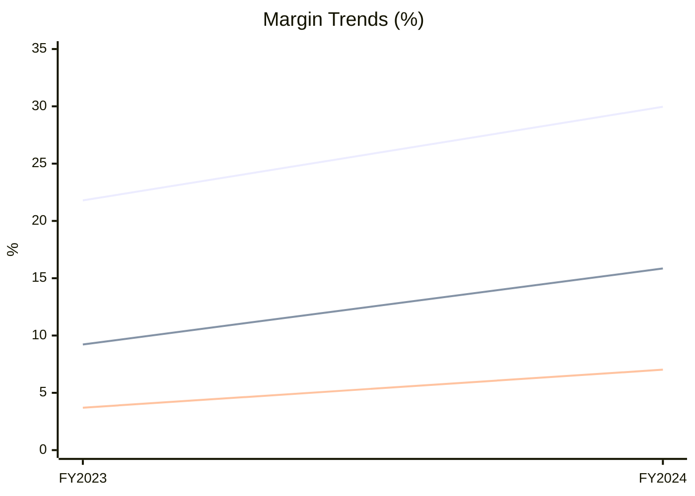

```mermaid
xychart-beta
    title "Revenue & Profit (RM'000)"
    x-axis [FY2023, FY2024]
    y-axis "RM'000" 0 --> 32000000
    bar [29616085, 30490671]
    bar [1095699, 2140539]
    bar [2729113, 4832969]
```

# Worker 2: Core Performance

## Data Access

Your data is **PRE-LOADED** in your prompt. All financial metrics you need are in the JSON bundle below.

**Do NOT** read any files (`fs_index.json`, `data_bundles.json`, etc.) -- everything is already provided.

---

## Canonical Data Ownership

**You own**: Revenue, gross margin, PBT, PAT, PATMI, attributable margin, EPS, earnings quality (PATMI/PAT, EPS vs PATMI growth, cash conversion).

**Do NOT restate**: Segment revenue/PBT (Section VI), admin expenses (Section XI), finance costs (Section XI), D/E or gearing (Section XIV), OCF trend commentary (Section XVI).

---

## Your Task

Write your sections using the data bundle.

**Output file**: `workspace/worker_2_sections.md`

Output ONLY markdown for your assigned sections.

---

### Section IV: Core Conclusions

**Format**: Highlights table + Risk Scan table + overall assessment.

#### Highlights

| # | Highlight | Evidence | Implication |
|---|-----------|----------|-------------|
| 1 | [Core strength or positive finding] | [Specific data: RM X, +Y%] | [What it means for investors] |
| 2 | [Core strength or positive finding] | [Specific data: RM X, +Y%] | [What it means for investors] |
| 3 | [Core strength or positive finding] | [Specific data: RM X, +Y%] | [What it means for investors] |

#### Risk Scan

| # | Risk | Evidence | Severity |
|---|------|----------|----------|
| 1 | [Specific risk factor] | [Data supporting the risk] | High / Medium / Low |
| 2 | [Specific risk factor] | [Data supporting the risk] | High / Medium / Low |
| 3 | [Specific risk factor] | [Data supporting the risk] | High / Medium / Low |

[1-2 sentence overall assessment connecting the highlights and risks into a coherent view.]

**Rules**: Exactly 3 highlights + 3 risks. Every cell filled. Evidence must include specific numbers. Implications and severity must answer "so what?". The assessment should not be generic -- it must reflect the specific interplay of this company's strengths and weaknesses.

---

### Section V: Core Financial Performance

**Format**: Four sub-sections, each with tables/charts and analytical insight paragraphs.

#### V.1 Income Statement Analysis

**Table 1: Income Statement Summary (RM'000)**

| Indicator | FY2024 | FY2023 | YoY | Comment |
|-----------|-------:|-------:|----:|---------|
| Revenue | [value] | [value] | [+X.X%] | [Brief note] |
| Cost of sales | (value) | (value) | [-X.X%] | [Brief note] |
| Gross profit | [value] | [value] | [+X.X%] | [Brief note] |
| Profit before tax | [value] | [value] | [+X.X%] | [Brief note] |
| Profit for the year | [value] | [value] | [+X.X%] | [Brief note] |
| PATMI (owners of parent) | [value] | [value] | [+X.X%] | [Brief note] |
| Basic EPS (sen) | [value] | [value] | [+X.X%] | [Brief note] |

**Insight**: [2-3 sentences analyzing the income statement dynamics. Explain the relationship between top-line growth and bottom-line conversion. Identify the primary driver (revenue expansion, cost discipline, or both). Note any material gap between PAT and PATMI and its cause. Reference specific numbers.]

---

#### V.2 Margin Analysis

**Table 2: Margin Analysis**

| Margin | FY2024 | FY2023 | Change |
|--------|-------:|-------:|-------:|
| Gross margin | X.X% | X.X% | +Xpp / -Xpp |
| PBT margin | X.X% | X.X% | +Xpp / -Xpp |
| PAT margin | X.X% | X.X% | +Xpp / -Xpp |
| PATMI margin | X.X% | X.X% | +Xpp / -Xpp |

**Chart 1: Margin Trajectory**

```mermaid
xychart-beta
    title "Margin Trends (%)"
    x-axis [FY2023, FY2024]
    y-axis "%" 0 --> [max_margin_rounded_up]
    line [gm_fy2023, gm_fy2024]
    line [pbt_margin_fy2023, pbt_margin_fy2024]
    line [patmi_margin_fy2023, patmi_margin_fy2024]
```

**Insight**: [2-3 sentences analyzing margin trends. Explain whether margins expanded or compressed and why (pricing power, cost structure, mix shift). Note the gap between gross margin and PBT margin (cost absorption). Comment on whether the margin trajectory is sustainable or at risk.]

---

#### V.3 Earnings Quality

**Table 3: Earnings Quality**

| Metric | FY2024 | FY2023 | Change | Signal |
|--------|-------:|-------:|-------:|--------|
| PATMI / PAT ratio | X.X% | X.X% | [delta pp] | ✅ / ⚠️ |
| EPS growth vs PATMI growth | X.X% | X.X% | [delta pp] | ✅ / ⚠️ |
| Cash conversion (OCF/PAT) | X.Xx | X.Xx | [delta] | ✅ / ⚠️ |

**Signal legend**: ✅ = healthy / consistent with expectations; ⚠️ = divergence or potential concern worth monitoring.

**Insight**: [2-3 sentences assessing earnings quality. Explain the PATMI/PAT ratio -- is non-controlling interest growing or stable? Compare EPS growth to PATMI growth -- any share dilution or one-off items? Evaluate cash conversion -- is operating cash flow backing reported profits? Flag any metric where the signal is a warning and explain the context.]

---

#### V.4 Key Findings & Tracking

**Table 4: Key Findings**

| Finding | Data | Interpretation |
|---------|------|----------------|
| [Finding 1 -- e.g., "Revenue acceleration/deceleration"] | [Value + change] | [Why -- volume, price, mix?] |
| [Finding 2 -- e.g., "Margin expansion/compression"] | [Value + bps/pp change] | [Driver -- pricing, cost, mix?] |
| [Finding 3 -- e.g., "Attributable profit trajectory"] | [Value + change] | [NCI impact, if material] |
| [Finding 4 -- e.g., "Earnings quality signal"] | [EPS/OCF/PATMI data] | [Cash backing? One-off items? Dilution?] |

**Chart 2: Revenue & Profit Trend**

```mermaid
xychart-beta
    title "Revenue & Profit (RM'000)"
    x-axis [FY2023, FY2024]
    y-axis "RM'000" 0 --> [max_value_rounded_up]
    bar [revenue_fy2023, revenue_fy2024]
    bar [patmi_fy2023, patmi_fy2024]
    bar [pbt_fy2023, pbt_fy2024]
```

**Tracking Recommendations**

- [Bullet 1: specific metric to monitor, with threshold or target -- e.g., "Gross margin: watch for reversal below X% if input costs rise"]
- [Bullet 2: specific metric with context -- e.g., "Revenue growth: monitor quarterly run-rate for signs of deceleration"]
- [Bullet 3: specific risk or opportunity to watch -- e.g., "Cash conversion: if OCF/PAT falls below 1.0x, investigate working capital or one-off items"]

---

## Your Data Bundle

You receive a JSON object with pre-extracted metrics. Here is the structure:

```json
{
  "metrics": {
    "revenue": { "current": 3252347, "prior": 2057210, "change": 1195137, "yoy_pct": 58.1 },
    "gross_profit": { "current": 502100, "prior": 380200, "change": 121900, "yoy_pct": 32.1 },
    "pbt": { "current": 276500, "prior": 189300, "change": 87200, "yoy_pct": 46.1 },
    "pat": { "current": null, "prior": null },
    "attributable_profit": { "current": null, "prior": null }
  },
  "expenses": {
    "administrative_expenses": { "current": null, "prior": null },
    "finance_costs": { "current": null, "prior": null },
    "taxation": { "current": null, "prior": null }
  },
  "margins": {
    "gross_margin": { "current": 15.44, "prior": 18.48 },
    "pbt_margin": { "current": 8.5, "prior": 9.2 },
    "pat_margin": { "current": null, "prior": null },
    "attributable_margin": { "current": null, "prior": null }
  },
  "earnings_quality": {
    "patmi_pat_ratio": { "current": null, "prior": null },
    "eps_growth_vs_patmi_growth": { "current": null, "prior": null },
    "cash_conversion_ocf_pat": { "current": null, "prior": null }
  },
  "eps": {
    "basic_eps_sen": { "current": null, "prior": null },
    "eps_yoy_pct": null
  }
}
```

**How to use it:**

- Values in RM'000 (divide by 1000 for RM million display)
- `null` values = not available in fs_index; display as "n.m." in tables
- Always calculate from raw values, never from rounded display values
- For earnings quality: if values are null, compute them from the metrics above (PATMI/PAT = attributable_profit / pat; EPS growth vs PATMI growth = eps_yoy_pct - attributable_profit yoy_pct; cash conversion = OCF from data bundle / pat)

---

## Output Format

```markdown
# IV. Core Conclusions - [Descriptive Subtitle]

## Highlights

| # | Highlight | Evidence | Implication |
|---|-----------|----------|-------------|
| 1 | Margin-led growth rather than volume-driven | Gross margin 29.96% (vs 21.79%); PBT margin 15.85% (vs 9.22%) | Operating leverage improved faster than top-line growth |
| 2 | Cash generation strengthened materially | OCF RM6,372.9m (vs RM4,670.9m); FCF RM2,673.2m (vs RM2,592.2m) | Internal cash engine supports capex and debt service |
| 3 | Capital structure directionally improving | Gearing 57% (vs 61%); debt/asset 72.79% (vs 75.31%) | Balance sheet risk material but deleveraging in progress |

## Risk Scan

| # | Risk | Evidence | Severity |
|---|------|----------|----------|
| 1 | Customer concentration | Top 3 customers = 60% of revenue | Medium |
| 2 | Elevated leverage | Net debt/equity 1.23x; interest coverage 4.8x | High |
| 3 | Working capital pressure | Receivables days up to 92 (vs 78); inventory days 145 (vs 130) | Medium |

The group exits FY2024 with stronger fundamentals driven by margin expansion, though concentration and leverage remain key constraints that warrant monitoring in FY2025.

# V. Core Financial Performance - [Descriptive Subtitle]

Based on audited statements, FY2024 performance improved materially versus FY2023 across profitability and owner earnings.

## V.1 Income Statement Analysis

**Table 1: Income Statement Summary (RM'000)**

| Indicator | FY2024 | FY2023 | YoY | Comment |
|-----------|-------:|-------:|----:|---------|
| Revenue | 30,490,671 | 29,616,085 | +2.95% | Moderate top-line growth |
| Cost of sales | (21,357,143) | (23,163,010) | -7.80% | Significant cost reduction vs revenue trend |
| Gross profit | 9,133,528 | 6,453,075 | +41.54% | Strong gross-level operating leverage |
| Profit before tax | 4,832,969 | 2,729,113 | +77.09% | Margin and finance line dynamics improved |
| Profit for the year | 3,884,731 | 2,122,344 | +83.04% | Group-wide earnings expanded sharply |
| PATMI (owners of parent) | 2,140,539 | 1,095,699 | +95.36% | Owner earnings nearly doubled |
| Basic EPS (sen) | 19.51 | 9.99 | +95.30% | EPS growth in line with PATMI |

**Insight**: Revenue grew modestly at +2.95% YoY to RM 30,490.7 million, while cost of sales declined 7.80%, creating substantial operating leverage at the gross level. This leverage cascaded through the P&L: PBT surged +77.09% and PATMI nearly doubled at +95.36% to RM 2,140.5 million. The gap between PAT (RM 3,884.7m) and PATMI (RM 2,140.5m) reflects a 55.1% attribution ratio, indicating material non-controlling interests in subsidiaries.

## V.2 Margin Analysis

**Table 2: Margin Analysis**

| Margin | FY2024 | FY2023 | Change |
|--------|-------:|-------:|-------:|
| Gross margin | 29.96% | 21.79% | +8.17pp |
| PBT margin | 15.85% | 9.22% | +6.64pp |
| PAT margin | 12.74% | 7.17% | +5.57pp |
| PATMI margin | 7.02% | 3.70% | +3.32pp |

**Chart 1: Margin Trajectory**



**Insight**: Gross margin expanded 8.17pp to 29.96%, the single largest driver of profitability improvement in FY2024. The narrower expansion at the PBT level (+6.64pp) versus gross (+8.17pp) suggests that operating expenses absorbed approximately 1.5pp of the gross margin gain. The 3.32pp PATMI margin expansion to 7.02% is meaningful for shareholders but remains modest in absolute terms, reflecting the structural impact of non-controlling interests on attributable earnings.

## V.3 Earnings Quality

**Table 3: Earnings Quality**

| Metric | FY2024 | FY2023 | Change | Signal |
|--------|-------:|-------:|-------:|--------|
| PATMI / PAT ratio | 55.1% | 51.6% | +3.5pp | ⚠️ |
| EPS growth vs PATMI growth | 95.3% | 95.4% | -0.1pp | ✅ |
| Cash conversion (OCF/PAT) | 1.64x | 2.20x | -0.56x | ⚠️ |

**Insight**: Earnings quality presents a mixed picture. The PATMI/PAT ratio ticked up to 55.1% (+3.5pp), meaning slightly more profit flows to parent shareholders, but the level remains below 60% -- a structural constraint for per-share returns. EPS growth matched PATMI growth (+95.3% vs +95.4%), confirming no material share dilution or one-off adjustments. However, cash conversion declined from 2.20x to 1.64x, warranting investigation into working capital movements or non-cash items in FY2024.

## V.4 Key Findings & Tracking

**Table 4: Key Findings**

| Finding | Data | Interpretation |
|---------|------|----------------|
| Revenue growth moderated | +2.95% to RM 30,490.7m | Top-line stable; improvement came from cost side |
| Gross margin expanded sharply | +8.17pp to 29.96% | Cost reduction and favorable segment mix |
| Owner earnings nearly doubled | PATMI +95.4% to RM 2,140.5m | Operating leverage flowed through to shareholders |
| Cash conversion declined | OCF/PAT 1.64x (vs 2.20x) | Working capital or non-cash items absorbed cash |

**Chart 2: Revenue & Profit Trend**



**Tracking Recommendations**

- Gross margin: monitor for reversal below 25% if input commodity prices recover or pricing power erodes in competitive segments
- PATMI/PAT ratio: watch whether the improving trend toward 55%+ continues; a sustained move above 60% would materially improve per-share returns
- Cash conversion: if OCF/PAT falls below 1.0x, investigate receivables days and inventory build-up as early warning of cash flow stress
```

---

## What to Avoid

- **Aggressive language**: "Explosive growth" -> "Strong growth of X%"; "Margin collapsed" -> "Margin declined Xpp"
- **Empty table cells**: Every cell must have a value. Use "n.m." if not available, never blank
- **Mixed units**: Keep RM'000 consistent within the income statement table; use RM million in prose where readability benefits
- **Fabricated numbers**: Every number must trace to your data bundle. If null, say "not disclosed" or "n.m."
- **Basis points vs percentage points**: Use "pp" for changes >= 100bps, "bps" for changes < 100bps
- **Generic insights**: Every Insight paragraph must reference specific numbers from the tables above and explain the causal relationship
- **Missing risks**: Section IV Risk Scan must flag actual concerns supported by data, not generic boilerplate risks
- **Signal without context**: Every warning signal in the Earnings Quality table must be explained in the Insight paragraph

## Quality Checklist

- [ ] Section IV Highlights table has exactly 3 rows, all cells filled with specific data
- [ ] Section IV Risk Scan table has exactly 3 rows, all cells filled with severity ratings
- [ ] Section IV has a 1-2 sentence overall assessment connecting highlights and risks
- [ ] Section V.1 Income Statement table has all 7 rows, all cells filled
- [ ] Section V.1 has a 2-3 sentence Insight paragraph analyzing income statement dynamics
- [ ] Section V.2 Margin Analysis table has all 4 rows, all cells filled
- [ ] Section V.2 Margin Trajectory chart uses actual numbers with rounded y-axis
- [ ] Section V.2 has a 2-3 sentence Insight paragraph analyzing margin trends
- [ ] Section V.3 Earnings Quality table has all 3 metrics with signals
- [ ] Section V.3 has a 2-3 sentence Insight paragraph explaining each signal
- [ ] Section V.4 Key Findings table has 4 rows, all cells filled
- [ ] Section V.4 Revenue & Profit Trend chart uses actual numbers with rounded y-axis
- [ ] Section V.4 Tracking Recommendations has 3 bullets with specific metrics and thresholds
- [ ] No empty cells in any table (use "n.m." for unavailable data)
- [ ] Currency notation consistent (RM throughout, not MYR)
- [ ] Margin changes use pp or bps appropriately (>= 100bps = pp, < 100bps = bps)
- [ ] Chart y-axis max values are rounded up to clean numbers
- [ ] Writing follows `references/writing_guidelines.md` (precision, tone, anti-patterns)
